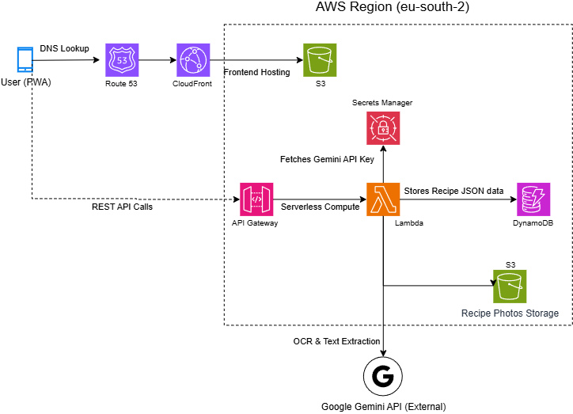

# recipe-keeper-aws-serverless

Live Demo: [https://d2tjksce0qbw7r.cloudfront.net/]

Test Credentials: Click "Try the Recruiter Demo" on the login screen, or use guest@recipekeeper.com / HireMe2026!

I originally built this app as a standalone frontend project using Supabase. As I started studying for my AWS Solutions Architect Associate (SAA) certification, I decided to take things a step further and migrate the entire project to a true AWS serverless architecture to put what I was learning into practice.

##  Architecture Blueprint

##  What the App Does
It’s a Progressive Web App (PWA) built for saving and managing recipes. It has two main AI features:
1. **Camera Scan:** Snap a photo of a handwritten recipe, and Google Gemini extracts the text.
2. **Web Import:** Paste a link to a food blog, and it automatically strips away the ads and layout to extract just the recipe details. 

It also uses a Service Worker to cache data locally, meaning the app and your saved recipes still load perfectly even if you lose cell service at the grocery store.

## The AWS Migration (Under the Hood)
I am currently transitioning this from a direct frontend-to-database setup into a secure, 3-tier AWS architecture. 

* **Hosting & CDN:** Moving from Netlify to **Amazon S3** for static hosting, distributed globally via **Amazon CloudFront**.
* **Backend Compute:** Replacing direct database calls with **AWS Lambda** functions behind an **Amazon API Gateway**. 
* **Database & Storage:** Moving the NoSQL data to **Amazon DynamoDB** and storing the recipe cover photos in a dedicated **Amazon S3** bucket.
* **Security Upgrade:** Previously, the Gemini API key was held in the frontend code. I am moving this to the backend and storing it securely in **AWS Secrets Manager**.

*(Note: This migration is currently in progress. I am actively writing the Infrastructure as Code and setting up the Lambda endpoints!)*
